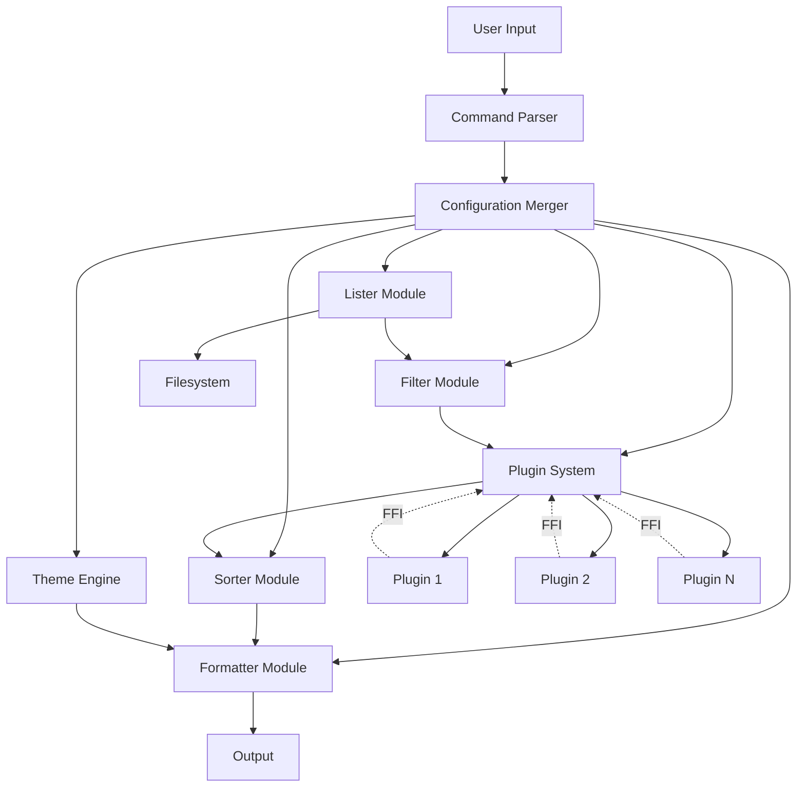
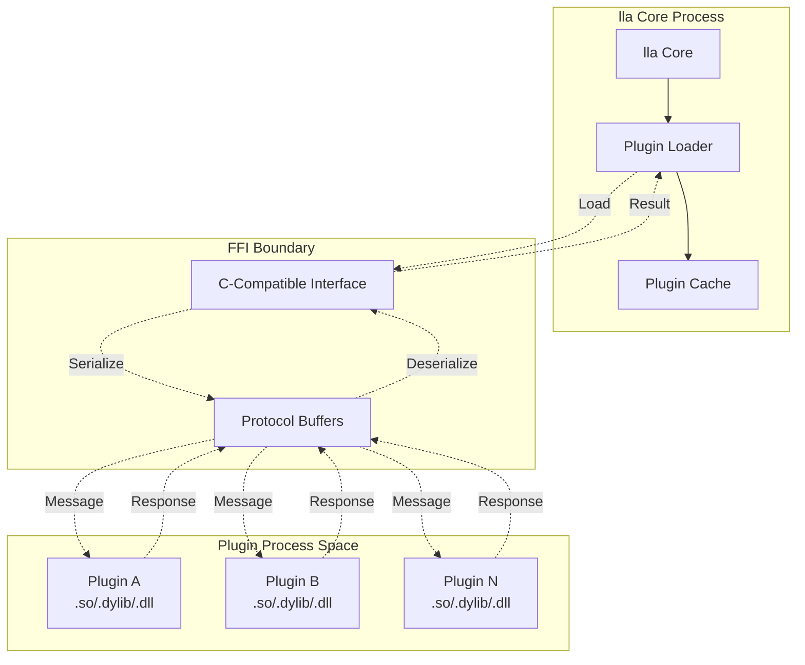
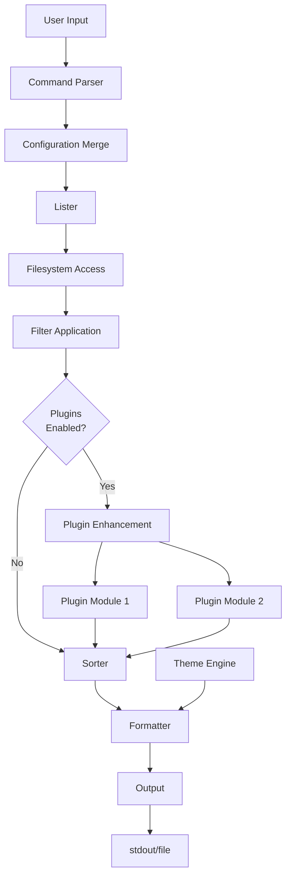
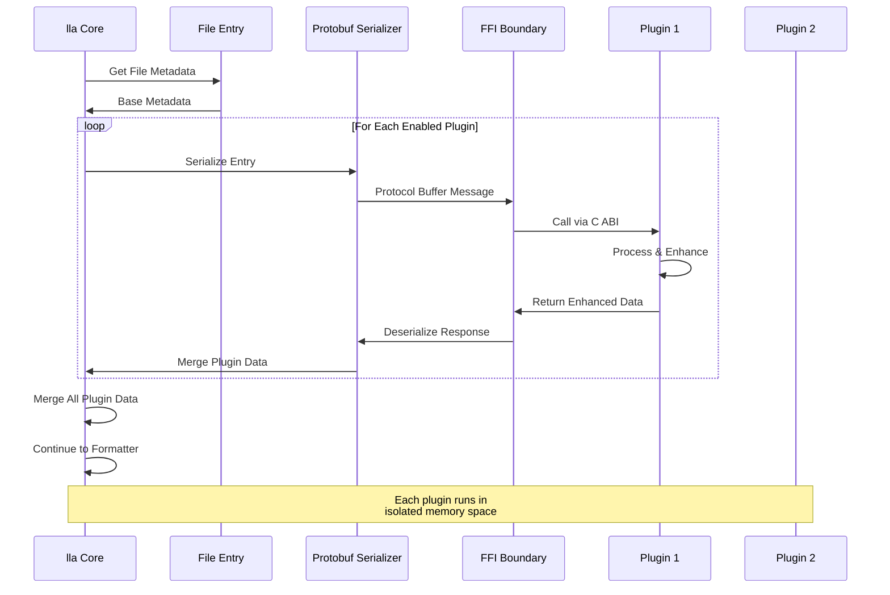
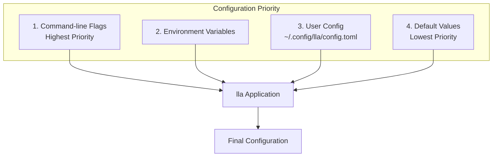

# Architecture Overview

lla is built with a modular architecture that prioritizes performance, extensibility, and maintainability. This document explains the key architectural decisions and how different components work together.

## Design Principles

### 1. Performance First

Every design decision in lla is evaluated for its performance impact:

- **Zero-cost abstractions**: Rust's trait system enables powerful abstractions without runtime overhead
- **Minimal allocations**: Careful memory management reduces garbage collection pauses
- **Parallel processing**: Where beneficial, operations run concurrently
- **Lazy evaluation**: Data is computed only when needed

### 2. Extensibility Through Plugins

The plugin system is a first-class citizen in lla's architecture:

- **Stable ABI**: Protocol Buffer-based communication ensures version independence
- **Isolation**: Plugins run in separate memory spaces with controlled interfaces
- **Zero impact**: Disabled plugins have zero performance cost
- **Composability**: Multiple plugins can enhance the same entry

### 3. Separation of Concerns

lla's codebase is organized into distinct, focused modules:

```
lla/
├── lister/      # Directory traversal and file discovery
├── formatter/   # Output formatting and presentation
├── sorter/      # Sorting algorithms and strategies
├── filter/      # File filtering logic
├── plugin/      # Plugin system and loader
└── theme/       # Color and styling engine
```

## Core Components

## Core Components

lla's architecture consists of several specialized modules that work together:



### Lister: File Discovery Engine

The lister module handles filesystem traversal and file discovery:

**Key responsibilities:**
- Reading directory contents efficiently
- Handling symbolic links and special files
- Archive introspection (zip, tar, tar.gz)
- Recursive directory walking with depth control
- Permission handling and error recovery

**Performance characteristics:**
- Uses OS-specific APIs for optimal performance
- Implements early termination for filtered results
- Batches filesystem calls to reduce syscall overhead

### Formatter: Presentation Layer

Formatters transform file data into visual output:

**Available formatters:**
- **Default**: Columnar layout optimized for quick scanning
- **Long**: Rich metadata display with permissions and timestamps
- **Tree**: Hierarchical visualization with Unicode line drawing
- **Grid**: Space-efficient multi-column layout
- **Table**: Structured data with aligned columns
- **Timeline**: Chronological grouping by modification time
- **Sizemap**: Visual file size distribution
- **Git**: Repository status with diff statistics

**Design patterns:**
- Each formatter implements a common trait
- Formatters compose with plugins for enriched output
- Streaming output for large directories
- Theme-aware coloring throughout

### Sorter: Organization Strategies

The sorter provides multiple sorting strategies:

**Sorting modes:**
- **Alphabetical**: Case-sensitive or insensitive, with natural number sorting
- **Size**: Largest-first or smallest-first
- **Date**: Newest-first or oldest-first (modified, created, accessed)

**Features:**
- Directory-first option for better navigation
- Stable sorting maintains original order for equal elements
- Optimized for large file lists

### Filter: Smart Selection

The filter module implements powerful file selection:

**Filter types:**
- **Text patterns**: Simple substring matching with OR/AND operators
- **Regular expressions**: Full regex support with capture groups
- **Glob patterns**: Shell-style wildcards
- **Type filters**: File, directory, symlink, dotfile filtering
- **Content search**: Ripgrep integration for searching file contents

**Implementation:**
- Filters compile to optimized predicates
- Early rejection minimizes expensive operations
- Caching for repeated pattern matching

### Plugin System: Extension Architecture

The plugin system uses a sophisticated message-based architecture:



**Key features:**
- **FFI boundary**: C-compatible interface ensures ABI stability
- **Protocol Buffers**: Language-agnostic message format
- **Versioning**: API version checking prevents incompatibilities
- **Isolation**: Plugins can't crash the main application

**Communication flow:**
1. lla serializes file metadata to Protocol Buffer
2. Message crosses FFI boundary as raw bytes
3. Plugin processes message, adds custom data
4. Response returns through FFI boundary
5. lla deserializes and integrates plugin data

[Learn more about plugin development →](/docs/guides/plugin-development-tutorial)

### Theme Engine: Visual Styling

The theme system provides comprehensive color customization:

**Theme architecture:**
- **TOML-based configuration**: Human-readable theme files
- **Layered resolution**: Specific rules override general defaults
- **Multiple color formats**: Named colors, RGB, hex, HSL
- **Extension grouping**: Logical file type categories

**Color resolution priority:**
1. Exact filename match (e.g., "Dockerfile")
2. Dot file pattern (e.g., ".gitignore")
3. Pattern match (e.g., "*.test.*")
4. Extension-specific color
5. Extension group color
6. Default file/directory color

## Data Flow

### Standard Listing Operation



### Plugin-Enhanced Listing



## Performance Optimizations

### Memory Management

- **Stack allocation**: Prefer stack over heap where possible
- **Arena allocation**: Bulk allocations for file lists
- **Sharing**: Reference counting avoids unnecessary copies
- **Streaming**: Large datasets stream to output

### Caching Strategies

- **Plugin metadata**: Plugin names/versions cached after first load
- **Git status**: Repository status cached per directory
- **Theme resolution**: Color lookups memoized
- **Stat caching**: Filesystem metadata cached during single operation

### Parallel Processing

lla uses parallelism judiciously:

- **Directory traversal**: Parallel when recursing deeply
- **Plugin execution**: Concurrent plugin calls where safe
- **Content search**: Ripgrep's built-in parallelism
- **Archive reading**: Parallel extraction for large archives

**Why not always parallel?**
- Small directories: overhead exceeds benefit
- Output ordering: some views require deterministic order
- Resource contention: too many threads can slow I/O

## Error Handling Philosophy

lla follows Rust's error handling best practices:

**Recoverable errors:**
- Permission denied on files: skip with warning
- Plugin loading failure: continue without plugin
- Invalid UTF-8 in filenames: display with replacement characters

**Unrecoverable errors:**
- Invalid command-line arguments: exit with usage help
- Configuration file parse error: exit with error message
- Cannot read current directory: exit with error

**User experience:**
- Errors are actionable with clear messages
- Warnings don't interrupt output flow
- Exit codes convey success/failure state

## Configuration System

Configuration follows a layered approach:



**Benefits:**
- Predictable behavior across environments
- Easy overrides for scripting
- Sensible defaults for zero-config usage

## Testing Strategy

lla employs multiple testing approaches:

- **Unit tests**: Individual component logic
- **Integration tests**: Full command execution
- **Property tests**: Fuzz testing with quickcheck
- **Performance benchmarks**: Criterion-based benchmarking

## Future Architecture Goals

### Planned improvements:

1. **Plugin marketplace**: Centralized plugin discovery and installation
2. **Watch mode**: Filesystem monitoring for live updates
3. **Remote filesystems**: Optimizations for network-mounted directories
4. **Plugin hot-reload**: Update plugins without restarting
5. **Configuration profiles**: Named config sets for different workflows

## Technical Stack

**Core technologies:**

- **Language**: Rust (2021 edition)
- **Serialization**: Protocol Buffers (prost)
- **CLI parsing**: clap v4
- **Async runtime**: tokio (where needed)
- **Terminal handling**: crossterm
- **Git integration**: git2
- **Content search**: ripgrep (as library)
- **Syntax highlighting**: syntect

## Contributing to the Architecture

When contributing to lla:

1. **Maintain separation of concerns**: Keep modules focused
2. **Document design decisions**: Explain why, not just what
3. **Benchmark changes**: Prove performance claims
4. **Consider extensibility**: Will plugins need this?
5. **Test thoroughly**: Cover edge cases

[Read the contribution guide →](/docs/support/contributing)

