# Getting Started Tutorial

Welcome to lla! This 15-minute hands-on tutorial will teach you everything you need to become productive with lla. We'll use practical examples and build on each concept progressively.

## What You'll Learn

- Installing and setting up lla
- Navigating directories with different views
- Filtering and searching for files
- Customizing appearance with themes
- Using plugins to extend functionality
- Creating useful aliases and shortcuts

## Prerequisites

- A terminal/command line interface
- Basic familiarity with command-line navigation
- 15 minutes of your time

## Learning Path

Here's your journey through this tutorial:

```mermaid
graph LR
    A[Install lla] --> B[First Listing]
    B --> C[Explore Views]
    C --> D[Sort & Filter]
    D --> E[Advanced Filtering]
    E --> F[Customize]
    F --> G[Git Integration]
    G --> H[Try Plugins]
    H --> I[Create Aliases]
    I --> J[Master lla! 🎉]
```



Let's get started!

## Step 1: Installation (2 minutes)

First, let's install lla:

```bash
# Quick install (recommended)
curl -sSL https://raw.githubusercontent.com/chaqchase/lla/main/install.sh | bash

# Or using cargo
cargo install lla
```

Verify installation:

```bash
lla --version
```

You should see output like `lla 0.3.9`.

**Can't find lla?** Add it to your PATH:
```bash
export PATH="/usr/local/bin:$PATH"
```

## Step 2: Your First Listing (1 minute)

Let's start simple. Navigate to any directory and run:

```bash
lla
```

You should see a clean, color-coded list of files and directories. Notice:
- Different colors for different file types
- Icons next to files (if your terminal supports them)
- Alphabetical sorting
- Hidden files (dotfiles) are shown

Try it in different directories:

```bash
lla ~              # Your home directory
lla /tmp           # System temp directory
lla ~/Documents    # Your documents
```

## Step 3: Understanding Views (3 minutes)

lla offers multiple ways to view your files. Let's try them:

### Long Format: Detailed Information

```bash
lla -l
```

You now see:
- Permissions (rwxr-xr-x)
- Owner and group
- File sizes
- Modification times
- File names

### Tree View: See Directory Structure

```bash
lla -t
```

This shows a hierarchical view of your directory structure. Perfect for understanding project layout!

Limit the depth:
```bash
lla -t -d 2    # Only 2 levels deep
```

### Grid View: Space-Efficient

```bash
lla -g
```

Files arranged in columns, perfect for directories with many files.

### Try This Exercise

Navigate to a project directory and compare views:

```bash
cd ~/projects/your-project  # Or any directory with subdirectories

lla           # Default view
lla -l        # Detailed view
lla -t -d 3   # Tree view, 3 levels
lla -g        # Grid view
```

**Which view do you prefer for different tasks?**

## Step 4: Sorting and Filtering (3 minutes)

### Sort by Size

Find the largest files:

```bash
lla -s size
```

Largest files appear first. Reverse it:

```bash
lla -s size -r
```

### Sort by Date

See what's new:

```bash
lla -s date
```

Newest files first!

### Filter by Name

Find all test files:

```bash
lla -f "test"
```

This shows only files containing "test" in their name.

Find by extension:

```bash
lla -f ".rs"     # All Rust files
lla -f ".py"     # All Python files
lla -f ".json"   # All JSON files
```

### Combine Techniques

Most powerful: combine sorting and filtering:

```bash
lla -f "test" -s size -l
```

This finds all test files, sorts by size, and shows detailed info!

### Try This Exercise

In a project directory:

```bash
# Find all config files
lla -f "config"

# Find largest JavaScript files
lla -f ".js" -s size

# Find recently modified Python files
lla -f ".py" -s date

# Show detailed info about test files
lla -f "test" -l
```

## Step 5: Advanced Filtering (2 minutes)

### Show Only Specific Types

```bash
lla --files-only      # No directories
lla --dirs-only       # Only directories
lla --no-dotfiles     # Hide hidden files
```

### Combine Filters

```bash
# Only regular files, no hidden files
lla --files-only --no-dotfiles

# Only hidden directories
lla --dirs-only --dotfiles-only
```

### Try This Exercise

```bash
# Create a test directory
mkdir ~/lla-practice
cd ~/lla-practice

# Create some test files
touch file1.txt file2.txt test.txt
touch .hidden .config
mkdir subdir1 subdir2 .hidden-dir

# Now try different filters
lla --files-only
lla --dirs-only
lla --no-dotfiles
lla --dotfiles-only
```

## Step 6: Customization (2 minutes)

### Initialize Configuration

Create your config file:

```bash
lla init
```

This creates `~/.config/lla/config.toml` with default settings.

### View Current Config

```bash
lla config
```

### Change Settings

```bash
# Enable icons by default
lla config --set show_icons true

# Set default sorting
lla config --set default_sort size

# Directories first
lla config --set sort.dirs_first true
```

### Try Different Themes

```bash
# Interactive theme selector
lla theme

# Install all built-in themes
lla theme pull

# Try a specific theme
lla config --set theme dark
lla config --set theme dracula
lla config --set theme nord
```

### Try This Exercise

Customize lla to your preferences:

```bash
# What do you want as defaults?
lla config --set show_icons true
lla config --set default_sort name
lla config --set default_format long  # or default, tree, etc.

# Choose a theme you like
lla theme
```

## Step 7: Git Integration (2 minutes)

If you're in a Git repository, lla can show you file status!

Navigate to a Git repo and try:

```bash
lla -G
```

You'll see:
- Modified files (M)
- Untracked files (?)
- Staged files
- Branch name
- Commit information

Make a change to see it:

```bash
# In a Git repo
echo "test" >> README.md
lla -G
```

README.md should show as modified!

## Step 8: Plugins (Optional, 3 minutes)

Extend lla's functionality with plugins.

### Install First-Party Plugins

```bash
# Install all official plugins
lla install
```

This will prompt you to install Rust if you haven't already.

### Enable/Disable Plugins

```bash
# Interactive plugin manager
lla use
```

Navigate with arrow keys, toggle with spacebar.

### Try a Plugin

Enable the `git_status` plugin and list files:

```bash
lla --enable-plugin git_status
lla
```

You should see Git status information for each file!

### Popular Plugins to Try

- **file_meta**: Show detailed file metadata
- **git_status**: Git status for each file
- **file_hash**: Display file hashes
- **code_complexity**: Analyze code complexity

## Step 9: Create Useful Aliases (1 minute)

Make lla even faster with aliases!

Add to your `~/.bashrc` or `~/.zshrc`:

```bash
# Quick aliases
alias ll='lla -l'
alias lt='lla -t'
alias lg='lla -G'
alias lf='lla --fuzzy'

# Sorted views
alias lls='lla -l -s size'
alias llt='lla -l -s date'

# Project exploration
alias tree='lla -t -d 3'
```

Reload your shell:

```bash
source ~/.bashrc  # or ~/.zshrc
```

Now you can use:

```bash
ll        # Long format
lt        # Tree view
lls       # Sort by size
```

## Quick Reference

Here's everything you learned:

```bash
# Views
lla                 # Default view
lla -l              # Long format (detailed)
lla -t              # Tree view
lla -t -d 3         # Tree view, 3 levels
lla -g              # Grid view
lla -G              # Git view

# Sorting
lla -s name         # Sort by name (default)
lla -s size         # Sort by size
lla -s date         # Sort by date
lla -r              # Reverse order

# Filtering
lla -f "pattern"    # Filter by pattern
lla -f ".rs"        # Filter by extension
lla --files-only    # Only files
lla --dirs-only     # Only directories
lla --no-dotfiles   # Hide hidden files

# Combination
lla -f "test" -s size -l     # Filter, sort, detailed view

# Customization
lla init            # Create config
lla config          # View config
lla theme           # Choose theme

# Plugins
lla install         # Install plugins
lla use             # Manage plugins

# Help
lla -h              # Quick help
lla --help          # Detailed help
```

## Real-World Workflows

Now that you know the basics, here are some practical workflows:

### Workflow 1: Exploring a New Codebase

```bash
# Get an overview
lla -t -d 2

# Find the main entry points
lla -f "main"

# See what was changed recently
lla -s date | head -10

# Find all test files
lla -R -f "test"
```

### Workflow 2: Disk Space Investigation

```bash
# Find largest files
lla -s size -l | head -20

# Visualize space usage
lla -S --include-dirs

# Find large files recursively
lla -R -s size | head -30
```

### Workflow 3: Quick File Discovery

```bash
# Interactive search
lla --fuzzy

# Find all JSON configs
lla -f ".json"

# Find recently modified configs
lla -f "config" -s date
```

### Workflow 4: Git-Aware Development

```bash
# See what you've modified
lla -G --files-only

# Compare directories
lla src/ -G
lla tests/ -G

# Check for untracked files
lla -G | grep "?"
```

## Common Pitfalls to Avoid

1. **Forgetting depth limits in tree view**: `lla -t` in a large project can be slow
   - Solution: `lla -t -d 3`

2. **Not using filters**: Listing everything when you need specific files
   - Solution: `lla -f "pattern"`

3. **Ignoring machine output**: lla works great in scripts!
   - Solution: `lla --json | jq` for processing

4. **Not customizing**: Using default settings when you have preferences
   - Solution: `lla init` and customize `~/.config/lla/config.toml`

## Next Steps

Congratulations! You now know the fundamentals of lla. Here's what to explore next:

- **[View Formats Guide](/docs/usage/view-formats)**: Learn about timeline, sizemap, and table views
- **[Advanced Filtering](/docs/usage/file-filtering)**: Master regex and logic operators
- **[Plugin Development](/docs/guides/plugin-development-tutorial)**: Create your own plugins
- **[Configuration Guide](/docs/usage/config)**: Deep dive into customization

## Practice Exercises

Reinforce your learning:

### Exercise 1: File Discovery

```bash
# Create a practice directory
mkdir ~/lla-exercises
cd ~/lla-exercises

# Create various files
touch app.js app.test.js config.json README.md
touch main.py test_main.py requirements.txt
mkdir src tests docs

# Now practice:
# 1. List only Python files
# 2. Find all test files
# 3. Show a tree view 2 levels deep
# 4. Sort by name with directories first
```

### Exercise 2: Customization Challenge

```bash
# Customize lla to have these defaults:
# - Long format
# - Icons enabled
# - Directories first
# - Use the "dark" theme
# - Sort by size

# Hint: Use lla config --set ...
```

### Exercise 3: Create Workflow Aliases

Create aliases for these common tasks:
- List all test files sorted by date
- Show Git status in long format
- Interactive file search
- Tree view 3 levels deep

## Getting Help

Remember these resources:

- `lla -h`: Quick help
- `lla --help`: Detailed help
- `lla config`: View your configuration
- [Documentation](https://lla.chaqchase.com): Full guides
- [FAQ](/docs/support/faq): Common questions
- [GitHub Issues](https://github.com/chaqchase/lla/issues): Report problems

## Conclusion

You've learned:
- ✅ Installing and verifying lla
- ✅ Using different views (default, long, tree, grid, Git)
- ✅ Sorting and filtering files
- ✅ Customizing with themes and config
- ✅ Using plugins
- ✅ Creating useful aliases
- ✅ Real-world workflows

**Now go explore your file system with your new superpower!** 🚀

Share what you've learned:
- Tweet your favorite lla command
- Share your custom theme
- Create a useful plugin
- Help others in the community

Happy exploring!
