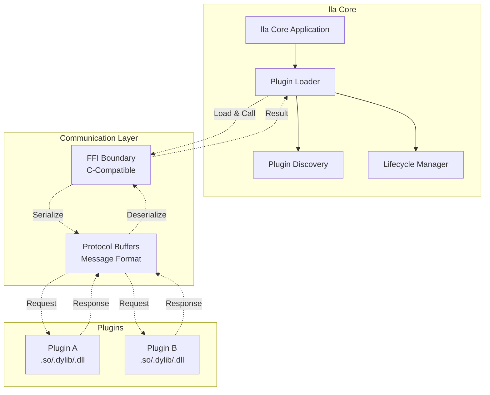

# Plugin Development Tutorial

Welcome to the complete guide for creating lla plugins! This tutorial will take you from zero to a fully functional plugin, explaining every concept along the way.

## What You'll Build

In this tutorial, you'll create a **File Age Indicator** plugin that shows how long ago files were modified using friendly time descriptions like "2 hours ago" or "3 days ago". This plugin demonstrates:

- Plugin architecture fundamentals
- Protocol Buffer communication
- File metadata processing
- Custom field injection
- Configuration management
- Action handling
- Testing strategies

## Prerequisites

Before you begin, ensure you have:

- **Rust toolchain** (1.70 or later): Install from [rustup.rs](https://rustup.rs)
- **lla installed**: Follow the [installation guide](/docs/about/installation)
- **Basic Rust knowledge**: Understanding of structs, traits, and cargo
- **Text editor**: Any editor with Rust support (VS Code, RustRover, Vim, etc.)

### Verify Your Setup

```bash
# Check Rust installation
rustc --version
cargo --version

# Check lla installation
lla --version

# Create a workspace
mkdir lla-file-age-plugin
cd lla-file-age-plugin
```

## Understanding Plugin Architecture

Before writing code, let's understand how lla plugins work.

### The Big Picture



### Key Concepts

1. **FFI Boundary**: Plugins communicate with lla through a C-compatible Foreign Function Interface (FFI)
2. **Protocol Buffers**: All messages use Protocol Buffer serialization for version independence
3. **Isolation**: Each plugin runs in its own memory space; crashes won't affect lla
4. **Decoration Pattern**: Plugins "decorate" file entries with additional data
5. **Actions**: Plugins can expose custom commands for user interaction

### Why This Architecture?

- **ABI Stability**: Protocol Buffers eliminate Rust's ABI instability issues
- **Version Independence**: Plugins work across lla versions without recompilation
- **Language Agnostic**: Could theoretically write plugins in other languages
- **Safety**: Plugins can't corrupt lla's memory or crash the application

## Project Setup

### 1. Create the Project

```bash
cargo new --lib lla-file-age-plugin
cd lla-file-age-plugin
```

### 2. Configure Cargo.toml

Edit `Cargo.toml` to add dependencies and configure the library:

```toml
[package]
name = "lla_file_age"
version = "0.1.0"
edition = "2021"

[lib]
crate-type = ["cdylib"]  # Dynamic library for lla

[dependencies]
# Core plugin interfaces
lla_plugin_interface = "0.1"
lla_plugin_utils = "0.1"

# Protocol Buffer support
prost = "0.12"
bytes = "1.5"

# Time handling
chrono = "0.4"

# Serialization
serde = { version = "1.0", features = ["derive"] }
toml = "0.8"

[dev-dependencies]
tempfile = "3.8"
```

**Understanding the dependencies:**

- `lla_plugin_interface`: Core trait definitions and Protocol Buffer messages
- `lla_plugin_utils`: Helper utilities for common plugin tasks
- `prost`/`bytes`: Protocol Buffer handling
- `chrono`: Time calculations
- `serde`/`toml`: Configuration file handling

### 3. Create Project Structure

```bash
mkdir -p src/{config,actions}
touch src/config/mod.rs
touch src/actions/mod.rs
```

Your structure should look like:
```
lla-file-age-plugin/
├── Cargo.toml
├── src/
│   ├── lib.rs           # Main plugin code
│   ├── config/
│   │   └── mod.rs       # Configuration handling
│   └── actions/
│       └── mod.rs       # Custom actions
```

## Implementing the Plugin

### Step 1: Define Configuration

Create `src/config/mod.rs`:

```rust
use serde::{Deserialize, Serialize};
use std::path::PathBuf;

#[derive(Debug, Clone, Serialize, Deserialize)]
pub struct Config {
    /// Enable/disable the plugin
    pub enabled: bool,
    
    /// Color for recent files (< 1 hour)
    pub color_recent: String,
    
    /// Color for moderate files (< 1 day)
    pub color_moderate: String,
    
    /// Color for old files (< 1 week)
    pub color_old: String,
    
    /// Color for very old files
    pub color_very_old: String,
    
    /// Use relative time format
    pub use_relative_time: bool,
}

impl Default for Config {
    fn default() -> Self {
        Self {
            enabled: true,
            color_recent: "bright_green".to_string(),
            color_moderate: "bright_yellow".to_string(),
            color_old: "bright_red".to_string(),
            color_very_old: "red".to_string(),
            use_relative_time: true,
        }
    }
}

impl Config {
    /// Load config from file or create default
    pub fn load() -> Result<Self, Box<dyn std::error::Error>> {
        let config_dir = dirs::config_dir()
            .ok_or("Could not find config directory")?
            .join("lla")
            .join("file_age");
            
        let config_path = config_dir.join("config.toml");
        
        if config_path.exists() {
            let content = std::fs::read_to_string(&config_path)?;
            Ok(toml::from_str(&content)?)
        } else {
            // Create default config
            let config = Self::default();
            std::fs::create_dir_all(&config_dir)?;
            let toml_string = toml::to_string_pretty(&config)?;
            std::fs::write(&config_path, toml_string)?;
            Ok(config)
        }
    }
    
    /// Get color based on age
    pub fn color_for_age(&self, seconds: i64) -> &str {
        const HOUR: i64 = 3600;
        const DAY: i64 = 86400;
        const WEEK: i64 = 604800;
        
        if seconds < HOUR {
            &self.color_recent
        } else if seconds < DAY {
            &self.color_moderate
        } else if seconds < WEEK {
            &self.color_old
        } else {
            &self.color_very_old
        }
    }
}
```

### Step 2: Implement Time Formatting

Add to `src/lib.rs`:

```rust
mod config;
mod actions;

use chrono::{DateTime, Utc, Duration};
use lla_plugin_interface::{DecoratedEntry, Plugin};
use prost::Message as ProstMessage;
use std::sync::Mutex;

/// Formats a duration into human-readable text
fn format_relative_time(seconds: i64) -> String {
    const MINUTE: i64 = 60;
    const HOUR: i64 = 3600;
    const DAY: i64 = 86400;
    const WEEK: i64 = 604800;
    const MONTH: i64 = 2592000; // 30 days
    const YEAR: i64 = 31536000; // 365 days
    
    let abs_seconds = seconds.abs();
    
    let (value, unit) = if abs_seconds < MINUTE {
        (abs_seconds, "second")
    } else if abs_seconds < HOUR {
        (abs_seconds / MINUTE, "minute")
    } else if abs_seconds < DAY {
        (abs_seconds / HOUR, "hour")
    } else if abs_seconds < WEEK {
        (abs_seconds / DAY, "day")
    } else if abs_seconds < MONTH {
        (abs_seconds / WEEK, "week")
    } else if abs_seconds < YEAR {
        (abs_seconds / MONTH, "month")
    } else {
        (abs_seconds / YEAR, "year")
    };
    
    let plural = if value != 1 { "s" } else { "" };
    format!("{} {}{} ago", value, unit, plural)
}

#[cfg(test)]
mod tests {
    use super::*;
    
    #[test]
    fn test_time_formatting() {
        assert_eq!(format_relative_time(30), "30 seconds ago");
        assert_eq!(format_relative_time(60), "1 minute ago");
        assert_eq!(format_relative_time(3600), "1 hour ago");
        assert_eq!(format_relative_time(7200), "2 hours ago");
        assert_eq!(format_relative_time(86400), "1 day ago");
    }
}
```

### Step 3: Implement the Plugin Trait

Continue in `src/lib.rs`:

```rust
pub struct FileAgePlugin {
    config: Mutex<config::Config>,
}

impl FileAgePlugin {
    pub fn new() -> Self {
        Self {
            config: Mutex::new(config::Config::load().unwrap_or_default()),
        }
    }
    
    fn process_entry(&self, entry: &DecoratedEntry) -> Option<String> {
        let config = self.config.lock().ok()?;
        
        if !config.enabled {
            return None;
        }
        
        // Get modification time from metadata
        let modified_timestamp = entry.metadata.as_ref()?.modified?;
        let modified = DateTime::<Utc>::from_timestamp(modified_timestamp as i64, 0)?;
        let now = Utc::now();
        let duration = now.signed_duration_since(modified);
        
        if config.use_relative_time {
            Some(format_relative_time(duration.num_seconds()))
        } else {
            Some(modified.format("%Y-%m-%d %H:%M:%S").to_string())
        }
    }
}

impl Plugin for FileAgePlugin {
    fn handle_raw_request(&mut self, request: &[u8]) -> Vec<u8> {
        use lla_plugin_interface::proto::{self, plugin_message};
        
        // Decode incoming protobuf message
        let proto_msg = match proto::PluginMessage::decode(request) {
            Ok(msg) => msg,
            Err(e) => return self.encode_error(&format!("Failed to decode request: {}", e)),
        };
        
        // Handle different message types
        let response_msg = match proto_msg.message {
            // Metadata requests
            Some(plugin_message::Message::GetName(_)) => {
                plugin_message::Message::NameResponse("file_age".to_string())
            }
            Some(plugin_message::Message::GetVersion(_)) => {
                plugin_message::Message::VersionResponse(env!("CARGO_PKG_VERSION").to_string())
            }
            Some(plugin_message::Message::GetDescription(_)) => {
                plugin_message::Message::DescriptionResponse(
                    "Shows how long ago files were modified".to_string(),
                )
            }
            
            // File decoration request
            Some(plugin_message::Message::Decorate(entry)) => {
                let mut decorated_entry = match DecoratedEntry::try_from(entry.clone()) {
                    Ok(e) => e,
                    Err(e) => return self.encode_error(&format!("Failed to convert entry: {}", e)),
                };
                
                // Add age information to custom fields
                if let Some(age_str) = self.process_entry(&decorated_entry) {
                    decorated_entry.custom_fields.insert("age".to_string(), age_str);
                    
                    // Optionally add color hint
                    if let Some(metadata) = &decorated_entry.metadata {
                        if let Some(modified) = metadata.modified {
                            let now = Utc::now().timestamp();
                            let age_seconds = now - (modified as i64);
                            let config = self.config.lock().unwrap();
                            let color = config.color_for_age(age_seconds);
                            decorated_entry.custom_fields.insert(
                                "age_color".to_string(),
                                color.to_string()
                            );
                        }
                    }
                }
                
                plugin_message::Message::DecoratedResponse(decorated_entry.into())
            }
            
            // Handle custom actions
            Some(plugin_message::Message::Action(action)) => {
                return self.handle_action(&action.name, &action.args);
            }
            
            _ => plugin_message::Message::ErrorResponse("Invalid request type".to_string()),
        };
        
        // Encode and return response
        let response = proto::PluginMessage {
            message: Some(response_msg),
        };
        let mut buf = bytes::BytesMut::with_capacity(response.encoded_len());
        response.encode(&mut buf).unwrap();
        buf.to_vec()
    }
}

// Utility method for encoding errors
impl FileAgePlugin {
    fn encode_error(&self, error: &str) -> Vec<u8> {
        use lla_plugin_interface::proto::{self, plugin_message};
        
        let response = proto::PluginMessage {
            message: Some(plugin_message::Message::ErrorResponse(error.to_string())),
        };
        let mut buf = bytes::BytesMut::with_capacity(response.encoded_len());
        response.encode(&mut buf).unwrap();
        buf.to_vec()
    }
    
    fn handle_action(&self, action_name: &str, args: &[String]) -> Vec<u8> {
        match action_name {
            "help" => self.action_help(),
            "toggle" => self.action_toggle(),
            "set-format" => self.action_set_format(args),
            _ => self.encode_error(&format!("Unknown action: {}", action_name)),
        }
    }
    
    fn action_help(&self) -> Vec<u8> {
        let help_text = r#"File Age Plugin Actions:
        
    toggle          - Toggle plugin on/off
    set-format      - Set time format (relative|absolute)
    help            - Show this help message
    
Examples:
    lla plugin --name file_age --action toggle
    lla plugin --name file_age --action set-format --args "relative"
"#;
        use lla_plugin_interface::proto::{self, plugin_message};
        
        let response = proto::PluginMessage {
            message: Some(plugin_message::Message::ActionResponse(help_text.to_string())),
        };
        let mut buf = bytes::BytesMut::with_capacity(response.encoded_len());
        response.encode(&mut buf).unwrap();
        buf.to_vec()
    }
    
    fn action_toggle(&self) -> Vec<u8> {
        use lla_plugin_interface::proto::{self, plugin_message};
        
        let mut config = self.config.lock().unwrap();
        config.enabled = !config.enabled;
        let status = if config.enabled { "enabled" } else { "disabled" };
        
        let response = proto::PluginMessage {
            message: Some(plugin_message::Message::ActionResponse(
                format!("File age plugin {}", status)
            )),
        };
        let mut buf = bytes::BytesMut::with_capacity(response.encoded_len());
        response.encode(&mut buf).unwrap();
        buf.to_vec()
    }
    
    fn action_set_format(&self, args: &[String]) -> Vec<u8> {
        use lla_plugin_interface::proto::{self, plugin_message};
        
        if args.is_empty() {
            return self.encode_error("Missing format argument (relative|absolute)");
        }
        
        let mut config = self.config.lock().unwrap();
        let message = match args[0].as_str() {
            "relative" => {
                config.use_relative_time = true;
                "Set to relative time format"
            }
            "absolute" => {
                config.use_relative_time = false;
                "Set to absolute time format"
            }
            _ => return self.encode_error("Invalid format. Use 'relative' or 'absolute'"),
        };
        
        let response = proto::PluginMessage {
            message: Some(plugin_message::Message::ActionResponse(message.to_string())),
        };
        let mut buf = bytes::BytesMut::with_capacity(response.encoded_len());
        response.encode(&mut buf).unwrap();
        buf.to_vec()
    }
}

// Register the plugin with lla
lla_plugin_interface::declare_plugin!(FileAgePlugin);
```

### Step 4: Add Missing Dependencies

Update your `Cargo.toml` to include the `dirs` crate:

```toml
[dependencies]
# ... existing dependencies ...
dirs = "5.0"
```

## Building and Testing

### 1. Build the Plugin

```bash
cargo build --release
```

This creates a dynamic library in `target/release/`:
- Linux: `liblla_file_age.so`
- macOS: `liblla_file_age.dylib`
- Windows: `lla_file_age.dll`

### 2. Install the Plugin

```bash
# Create plugin directory if it doesn't exist
mkdir -p ~/.config/lla/plugins

# Copy the plugin (adjust extension for your OS)
cp target/release/liblla_file_age.so ~/.config/lla/plugins/

# Or use lla's install command
lla install --dir .
```

### 3. Test the Plugin

```bash
# Enable the plugin
lla use  # Interactive selection

# Or enable via command line
lla --enable-plugin file_age

# List files to see the plugin in action
lla -l

# Test custom actions
lla plugin --name file_age --action help
lla plugin --name file_age --action toggle
```

## Adding Configuration UI

Create `~/.config/lla/file_age/config.toml`:

```toml
enabled = true
color_recent = "bright_green"
color_moderate = "bright_yellow"
color_old = "bright_red"
color_very_old = "red"
use_relative_time = true
```

## Testing Strategies

### Unit Tests

Add to `src/lib.rs`:

```rust
#[cfg(test)]
mod tests {
    use super::*;
    
    #[test]
    fn test_plugin_creation() {
        let plugin = FileAgePlugin::new();
        assert!(plugin.config.lock().is_ok());
    }
    
    #[test]
    fn test_config_defaults() {
        let config = config::Config::default();
        assert_eq!(config.enabled, true);
        assert_eq!(config.use_relative_time, true);
    }
    
    #[test]
    fn test_color_selection() {
        let config = config::Config::default();
        assert_eq!(config.color_for_age(1800), "bright_green");  // 30 min
        assert_eq!(config.color_for_age(43200), "bright_yellow"); // 12 hours
        assert_eq!(config.color_for_age(259200), "bright_red");  // 3 days
    }
}
```

Run tests:
```bash
cargo test
```

### Integration Testing

Create a test directory:
```bash
mkdir test_files
cd test_files
touch old_file.txt
touch -t 202301010000 very_old_file.txt
cd ..

# Test with your plugin
lla test_files/
```

## Best Practices

### 1. Error Handling

Always handle errors gracefully:

```rust
// ✅ Good: Return error message
Err(e) => return self.encode_error(&format!("Failed: {}", e)),

// ❌ Bad: Panic
Err(e) => panic!("This crashes lla!")
```

### 2. Performance

Be mindful of performance:

```rust
// ✅ Good: Cache expensive computations
if let Some(cached) = self.cache.get(&entry.path) {
    return cached.clone();
}

// ❌ Bad: Expensive operation on every file
let result = expensive_api_call(&entry.path);
```

### 3. Configuration

Provide sensible defaults:

```rust
impl Default for Config {
    fn default() -> Self {
        Self {
            enabled: true,  // Enable by default
            // ... more defaults
        }
    }
}
```

### 4. Documentation

Document your plugin's behavior:

```rust
/// Formats a timestamp into a human-readable relative time string.
/// 
/// # Examples
/// ```
/// assert_eq!(format_relative_time(3600), "1 hour ago");
/// ```
fn format_relative_time(seconds: i64) -> String {
    // implementation
}
```

## Publishing Your Plugin

### 1. Prepare for Release

Create a `README.md`:

```markdown
# lla File Age Plugin

Shows how long ago files were modified with friendly time descriptions.

## Features

- Relative time format ("2 hours ago")
- Color-coded by age
- Configurable time ranges
- Toggle on/off

## Installation

\`\`\`bash
lla install --git https://github.com/yourusername/lla-file-age-plugin
\`\`\`

## Configuration

Edit `~/.config/lla/file_age/config.toml`

## Usage

\`\`\`bash
lla --enable-plugin file_age
lla -l  # See file ages
\`\`\`
```

### 2. Add a License

```bash
# MIT License example
cp LICENSE.md .
```

### 3. Create a Git Repository

```bash
git init
git add .
git commit -m "Initial commit: File Age plugin"
git remote add origin https://github.com/yourusername/lla-file-age-plugin
git push -u origin main
```

### 4. Tag a Release

```bash
git tag -a v0.1.0 -m "First release"
git push origin v0.1.0
```

## Advanced Topics

### Async Operations

For I/O-heavy plugins:

```rust
use tokio::runtime::Runtime;

impl FileAgePlugin {
    fn process_async(&self, entry: &DecoratedEntry) -> Option<String> {
        let rt = Runtime::new().ok()?;
        rt.block_on(async {
            // Async operations here
            fetch_remote_data(&entry.path).await
        })
    }
}
```

### Caching

For expensive operations:

```rust
use std::collections::HashMap;
use std::time::{Duration, Instant};

struct Cache {
    data: HashMap<String, (String, Instant)>,
    ttl: Duration,
}

impl Cache {
    fn get(&mut self, key: &str) -> Option<String> {
        if let Some((value, timestamp)) = self.data.get(key) {
            if timestamp.elapsed() < self.ttl {
                return Some(value.clone());
            }
        }
        None
    }
    
    fn set(&mut self, key: String, value: String) {
        self.data.insert(key, (value, Instant::now()));
    }
}
```

### Multiple Format Support

Support both default and long formats:

```rust
fn format_for_display(&self, entry: &DecoratedEntry, format: &str) -> String {
    match format {
        "default" => format!("[{}]", self.get_age(entry)),
        "long" => format!("Modified: {} ago", self.get_age(entry)),
        _ => String::new(),
    }
}
```

## Troubleshooting

### Plugin Not Loading

**Check plugin directory:**
```bash
ls ~/.config/lla/plugins/
```

**Verify permissions:**
```bash
chmod +x ~/.config/lla/plugins/liblla_file_age.so
```

**Check lla output:**
```bash
lla --version  # Should list loaded plugins
```

### Debugging

Add debug logging:

```rust
eprintln!("DEBUG: Processing entry: {:?}", entry.path);
```

Use `RUST_LOG` environment variable:
```bash
RUST_LOG=debug lla
```

## Next Steps

Now that you've built your first plugin:

- **Explore existing plugins**: Check out [first-party plugins](https://github.com/chaqchase/lla/tree/main/plugins) for inspiration
- **Read the API reference**: See [Plugin API Reference](/docs/reference/api-reference) for complete documentation
- **Join the community**: Share your plugin and get feedback
- **Contribute**: Consider submitting your plugin as a first-party plugin

## Additional Resources

- [lla Plugin Interface](https://github.com/chaqchase/lla/tree/main/lla_plugin_interface)
- [Plugin Utils Library](https://github.com/chaqchase/lla/tree/main/lla_plugin_utils)
- [Existing Plugins](https://github.com/chaqchase/lla/tree/main/plugins)
- [Protocol Buffers Guide](https://protobuf.dev)

## Getting Help

If you run into issues:

- Check the [FAQ](/docs/support/faq)
- Visit the [Troubleshooting Guide](/docs/support/troubleshooting)
- Open an issue on [GitHub](https://github.com/chaqchase/lla/issues)
- Ask in community discussions

Happy plugin development! 🚀
