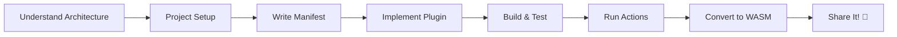
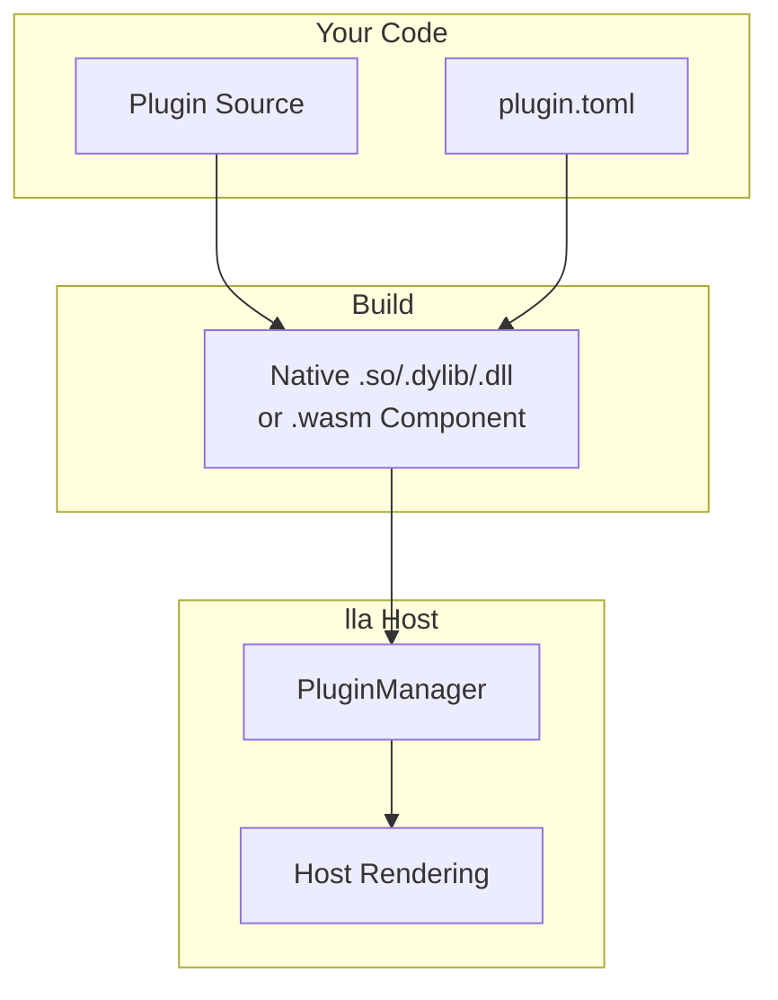

# Plugin Development Tutorial

In this tutorial you will build `file_score`, a complete Plugin Platform v3 plugin that decorates files with a score, formats it for humans, and exposes a typed `inspect` action. For the condensed authoring guide, see [Developing plugins](/docs/plugins/developing); for the full system design, see the [Architecture Handbook](/docs/about/architecture).

## What You'll Build

A plugin that:

- Decorates regular files with an integer `score` and string `size_class`
- Prints compact and long human fields
- Exposes a typed `inspect` action returning structured output

## Prerequisites

- Rust toolchain ([rustup.rs](https://rustup.rs))
- lla 0.6 installed ([Installation](/docs/about/installation))

Verify your setup:

```bash
cargo --version
lla --version
```

## Learning Path


```mermaid
graph LR
    A[Understand Architecture] --> B[Project Setup]
    B --> C[Write Manifest]
    C --> D[Implement Plugin]
    D --> E[Build & Test]
    E --> F[Run Actions]
    F --> G[Convert to WASM]
    G --> H[Share It! 🎉]
```

## Understanding Plugin Architecture

### The Big Picture


```mermaid
graph TB
    subgraph "Your Code"
        SRC[Plugin Source]
        TOML[plugin.toml]
    end
    subgraph "Build"
        LIB[Native .so/.dylib/.dll<br/>or .wasm Component]
    end
    subgraph "lla Host"
        MGR[PluginManager]
        FMT[Host Rendering]
    end
    SRC --> LIB
    TOML --> LIB
    LIB --> MGR
    MGR --> FMT
```

### Key Concepts

- **Manifest is the contract**: `plugin.toml` declares identity, capabilities, fields, actions, arguments, and permissions. The export macro embeds its exact bytes, and the host compares the embedded manifest with the packaged file before enabling the plugin.
- **Decoration**: The host sends batches of entries (at most 512); the plugin adds display strings and typed values.
- **Typed actions**: The host parses and validates arguments before calling the plugin, then renders the declared output (`none`, `text`, `value`, or `table`).
- **Two runtimes**: Native libraries are trusted in-process code; WebAssembly components run sandboxed with persisted grants.

## Project Setup

### 1. Create the Project

```bash
cargo new --lib file-score
cd file-score
```

### 2. Configure Cargo.toml

```toml
[package]
name = "file-score"
version = "1.0.0"
edition = "2021"
license = "MIT"

[lib]
name = "file_score"
crate-type = ["cdylib"]

[dependencies]
lla_plugin_sdk = "0.6"
```

While developing inside the lla repository, use the workspace dependency instead:

```toml
[dependencies]
lla_plugin_sdk.workspace = true
```

## Write the Manifest

Place `plugin.toml` beside `Cargo.toml`:

```toml
schema_version = 3

[plugin]
id = "dev.example.file-score"
name = "file_score"
version = "1.0.0"
api_min = 3
api_max = 3
runtime = "native"
entrypoint = "file_score"
description = "Score files from their filesystem metadata"
license = "MIT"
repository = "https://github.com/example/file-score"

[capabilities]
decorates_entries = true
formats = ["default", "long"]
machine_output = true

[permissions]
filesystem = ["metadata:selection", "read:user-path"]
network = []
process = false
clipboard = false
open_url = false

[[fields]]
name = "score"
type = "integer"
sortable = true
filterable = true
description = "A score derived from file size"

[[fields]]
name = "size_class"
type = "string"
sortable = true
filterable = true
description = "small, medium, or large"

[[actions]]
id = "inspect"
description = "Calculate a score for one path"
examples = [
  "lla plugin run file_score inspect -- README.md",
  "lla plugin run file_score inspect -- README.md --multiplier 2",
]
interactive = false
arguments = [
  { name = "path", type = "path", description = "File to inspect", position = 0, required = true },
  { name = "multiplier", type = "integer", description = "Score multiplier", option = "--multiplier", default = 1, min = 1, max = 10 },
]
output = { type = "value", schema = { path = "path", score = "integer", size_class = "string" } }
```

The native entrypoint is a logical library name. Packaging resolves it to the platform filename (`libfile_score.so`, `libfile_score.dylib`, or `file_score.dll`). See the [Manifest Reference](/docs/plugins/manifest) for every field.

## Implement the Plugin

Replace `src/lib.rs` with:

```rust
use lla_plugin_sdk::{
    interface::proto,
    response,
    value,
    ActionArguments,
    ActionArgumentsExt,
    DecoratedEntryExt,
    Plugin,
};

#[derive(Default)]
struct FileScore;

fn score(size: u64) -> i64 {
    if size == 0 {
        0
    } else {
        size.ilog2().min(100) as i64
    }
}

fn size_class(size: u64) -> &'static str {
    match size {
        0..=1023 => "small",
        1024..=1_048_575 => "medium",
        _ => "large",
    }
}

impl Plugin for FileScore {
    fn decorate_entry(
        &mut self,
        mut entry: proto::DecoratedEntry,
    ) -> proto::DecoratedEntry {
        let Some(metadata) = entry.metadata.as_ref() else {
            return entry;
        };
        if !metadata.is_file {
            return entry;
        }

        let size = metadata.size;
        entry.insert_field(
            "score",
            value::integer(score(size)),
            score(size).to_string(),
        );
        entry.insert_field(
            "size_class",
            value::string(size_class(size)),
            size_class(size),
        );
        entry
    }

    fn format_field(&mut self, entry: proto::DecoratedEntry, format: String) -> Option<String> {
        let score = entry.custom_fields.get("score")?;
        let class = entry.custom_fields.get("size_class")?;
        match format.as_str() {
            "default" => Some(format!("[score:{score}]")),
            "long" => Some(format!("score={score} class={class}")),
            _ => None,
        }
    }

    fn registered_actions(&mut self) -> Vec<proto::ActionInfo> {
        lla_plugin_sdk::manifest_action_infos(include_str!(concat!(
            env!("CARGO_MANIFEST_DIR"),
            "/plugin.toml"
        )))
    }

    fn run_action(&mut self, action: String, arguments: ActionArguments) -> proto::ActionResponse {
        if action != "inspect" {
            return response::error(format!("unknown action '{action}'"));
        }

        let path = match arguments.path("path") {
            Ok(Some(path)) => path,
            Ok(None) => return response::error("path is required"),
            Err(error) => return response::error(error),
        };
        let multiplier = match arguments.integer("multiplier") {
            Ok(Some(value)) => value,
            Ok(None) => 1,
            Err(error) => return response::error(error),
        };
        let metadata = match std::fs::metadata(&path) {
            Ok(metadata) => metadata,
            Err(error) => return response::error(format!("{}: {error}", path.display())),
        };
        let final_score = score(metadata.len()) * multiplier;

        response::value(value::object([
            ("path".to_string(), value::path(path.to_string_lossy())),
            ("score".to_string(), value::integer(final_score)),
            (
                "size_class".to_string(),
                value::string(size_class(metadata.len())),
            ),
        ]))
    }
}

lla_plugin_sdk::export_plugin!(FileScore);
```

Important details:

- `insert_field` writes both a display string and a typed value — preferred over keeping the two maps synchronized manually.
- The default `decorate_batch` calls `decorate_entry` per entry. Override it only to share expensive I/O across a batch, and always preserve entry count and order.
- `registered_actions` must return exactly the action IDs declared in the manifest. Building the inventory from the embedded manifest prevents drift.
- The export macro requires `Default + Send + 'static`, validates `plugin.toml` at compile time, and embeds the exact manifest.

## Build and Test

### 1. Build and Install

```bash
cargo fmt --check
cargo test
cargo build --release
lla install --dir "$PWD"
lla plugin doctor
lla plugin info file_score
```

The source installer creates the final package and checksum inventory. Do not copy only the `.so`, `.dylib`, or `.dll` into the plugin directory — v3 expects a complete package.

### 2. Enable and Use

```bash
lla use                                    # interactive manager
lla --enable-plugin file_score             # one invocation
lla -l --enable-plugin file_score
lla --json --pretty --enable-plugin file_score
```

### 3. Run the Typed Action

```bash
lla plugin run file_score inspect -- README.md
lla plugin run file_score inspect --output json -- README.md --multiplier 2
```

The first `--` ends host option parsing. Tokens after it are plugin-action arguments. Supported output formats are `human`, `json`, `ndjson`, and `csv`.

### 4. Add Fields to Columns

After persistently enabling the plugin:

```toml
[formatters.long]
columns = ["permissions", "size", "modified", "name", "field:score", "field:size_class"]
```

### Try This Exercise

1. Add a `large_file` boolean field that is true above 1 MiB
2. Declare it in `plugin.toml`, set it in `decorate_entry`, reinstall, and verify with `lla plugin doctor`
3. Render it in `format_field` for the `long` format

## Convert to WebAssembly

Use a Component Model plugin when portability and enforced permissions matter more than direct native integration.

### 1. Change the SDK Dependency

```toml
[dependencies]
lla_plugin_sdk = { version = "0.6", features = ["component"] }
```

### 2. Change the Manifest Runtime and Entrypoint

```toml
[plugin]
runtime = "wasm-component"
entrypoint = "file_score.wasm"
```

Everything else can stay the same, provided the implementation works within WASM host capabilities. A WASM manifest cannot request `process = true`.

### 3. Change the Export

```rust
lla_plugin_sdk::export_component!(FileScore);
```

### 4. Build the Component

```bash
rustup target add wasm32-wasip2
cargo build --release --target wasm32-wasip2
lla install --dir "$PWD"
lla plugin doctor
```

The output lands under `target/wasm32-wasip2/release/file_score.wasm`, and the source installer copies the declared entrypoint into the package. Loading it requires a host built with `wasm-plugins` (official Linux, macOS, and Windows binaries include it; NetBSD omits it).

WASM host capabilities: scoped filesystem preopens, exact-domain HTTP, gated clipboard and URL calls. Raw sockets and subprocesses are unavailable, and memory, responses, batches, and timeouts are bounded by the host.

## Testing Strategies

- `cargo test` for pure logic such as scoring functions
- `lla plugin doctor` after every manifest or handler change — it compares packaged and embedded manifests, validates checksums, and exercises the contract
- `lla plugin run ... --output json` to verify machine output before scripting against it
- Test with `--enable-plugin` on small directories first, then on archives and symlinks, since plugins must handle virtual or inaccessible paths safely

## Share Your Plugin

1. Give it a stable reverse-domain `id`, a version, a license, and a repository URL
2. Write a README with features, configuration, and `lla plugin run` examples
3. Verify a clean install: `lla install --dir /path/to/plugin && lla plugin doctor`
4. Publish the source so users can `lla install --git <url>`

To contribute it as a bundled plugin, follow [Contributing a bundled plugin](/docs/about/architecture#contributing-a-bundled-plugin) in the handbook.

## Quick Reference

```bash
# Scaffold
cargo new --lib my-plugin

# Manifest (plugin.toml beside Cargo.toml)
schema_version = 3

# Implement lla_plugin_sdk::Plugin, then export
lla_plugin_sdk::export_plugin!(MyPlugin);       # native
lla_plugin_sdk::export_component!(MyPlugin);    # WASM component

# Build, install, verify
cargo build --release
lla install --dir "$PWD"
lla plugin doctor

# Use
lla --enable-plugin my_plugin
lla plugin run my_plugin my_action -- args...
```

## Next Steps

- **[Developing Plugins](/docs/plugins/developing)**: Runtime choice, batching, and SDK fixtures
- **[Manifest Reference](/docs/plugins/manifest)**: Every manifest field and constraint
- **[Platform Architecture](/docs/plugins/architecture)**: ABI, Component Model runtime, and verification
- **[Architecture Handbook](/docs/about/architecture)**: Complete lifecycle, permissions, packaging, and troubleshooting
- **[Plugin Catalog](/docs/first-party-plugins/overview)**: Study the 37 bundled plugins as examples
