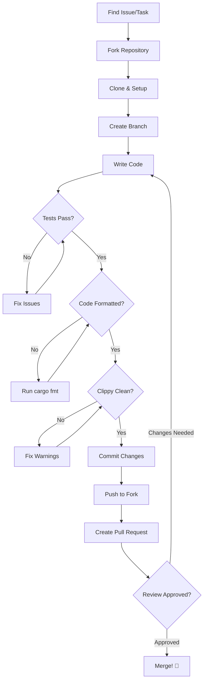

# Contributing to lla

Thank you for your interest in contributing to lla! This guide will help you get started, whether you're fixing bugs, adding features, writing documentation, or creating plugins.

## Ways to Contribute

There are many ways to contribute to lla:

- **Report bugs**: Help us identify and fix issues
- **Suggest features**: Share ideas for improvements
- **Write code**: Fix bugs or implement new features
- **Create plugins**: Extend lla's functionality
- **Improve documentation**: Help others learn lla
- **Answer questions**: Support other users
- **Share knowledge**: Write tutorials or blog posts

Every contribution, no matter how small, is valued and appreciated!

## Getting Started

### 1. Set Up Your Development Environment

**Prerequisites:**
- Rust 1.70 or later ([rustup.rs](https://rustup.rs))
- Git
- A code editor (VS Code, RustRover, Vim, etc.)

**Clone the repository:**

```bash
git clone https://github.com/chaqchase/lla.git
cd lla
```

**Build the project:**

```bash
cargo build
```

**Run tests:**

```bash
cargo test
```

**Try your local build:**

```bash
cargo run -- -l
```

### 2. Understand the Project Structure

```
lla/
├── lla/                          # Main application
│   ├── src/
│   │   ├── commands/             # Command implementations
│   │   ├── formatter/            # Output formatters
│   │   ├── lister/               # Directory listers
│   │   ├── plugin/               # Plugin system
│   │   ├── sorter/               # Sorting algorithms
│   │   ├── filter/               # File filtering
│   │   └── theme/                # Theme engine
│   └── Cargo.toml
├── lla_plugin_interface/         # Plugin FFI interface
├── lla_plugin_utils/             # Plugin helper utilities
├── plugins/                      # First-party plugins
│   ├── file_meta/
│   ├── git_status/
│   └── ...
└── themes/                       # Built-in themes
```

### 3. Find Something to Work On

**For beginners:**
- Look for issues labeled `good first issue` on GitHub
- Fix typos in documentation
- Improve error messages
- Add tests for existing code

**For experienced developers:**
- Issues labeled `help wanted`
- Performance optimizations
- New features from the roadmap
- Plugin development

**Browse the issues:** [github.com/chaqchase/lla/issues](https://github.com/chaqchase/lla/issues)

## Code Contributions

### Development Workflow



**Step-by-step:**

1. **Create a branch:**
   ```bash
   git checkout -b feature/your-feature-name
   # or
   git checkout -b fix/bug-description
   ```

2. **Make your changes:**
   - Write clear, focused commits
   - Follow the coding style (see below)
   - Add tests for new functionality
   - Update documentation as needed

3. **Test your changes:**
   ```bash
   # Run all tests
   cargo test
   
   # Run specific test
   cargo test test_name
   
   # Run with output
   cargo test -- --nocapture
   
   # Check formatting
   cargo fmt --check
   
   # Run clippy
   cargo clippy
   ```

4. **Commit your changes:**
   ```bash
   git add .
   git commit -m "Brief description of changes"
   ```

5. **Push and create a Pull Request:**
   ```bash
   git push origin feature/your-feature-name
   ```

   Then open a Pull Request on GitHub.

### Coding Standards

**Rust Style:**
- Follow the official [Rust Style Guide](https://doc.rust-lang.org/1.0.0/style/)
- Run `cargo fmt` before committing
- Run `cargo clippy` and fix warnings
- Use meaningful variable names
- Write self-documenting code

**Example:**

```rust
// ✅ Good: Clear, idiomatic Rust
pub fn format_file_size(bytes: u64) -> String {
    const UNITS: &[&str] = &["B", "KB", "MB", "GB", "TB"];
    
    if bytes == 0 {
        return "0 B".to_string();
    }
    
    let unit_index = (bytes as f64).log(1024.0).floor() as usize;
    let size = bytes as f64 / 1024_f64.powi(unit_index as i32);
    
    format!("{:.1} {}", size, UNITS[unit_index])
}

// ❌ Bad: Unclear, not idiomatic
pub fn fmt_sz(b: u64) -> String {
    let mut x = b as f64;
    let mut i = 0;
    while x >= 1024.0 {
        x /= 1024.0;
        i += 1;
    }
    format!("{:.1} {}", x, ["B", "KB", "MB"][i])
}
```

**Comments:**
- Use comments to explain *why*, not *what*
- Document public APIs with doc comments
- Keep comments up-to-date with code

```rust
/// Formats a file size in bytes to human-readable format.
/// 
/// # Examples
/// ```
/// assert_eq!(format_file_size(1024), "1.0 KB");
/// assert_eq!(format_file_size(1536), "1.5 KB");
/// ```
pub fn format_file_size(bytes: u64) -> String {
    // Implementation
}
```

**Error Handling:**
- Use `Result` for operations that can fail
- Provide meaningful error messages
- Don't panic in library code

```rust
// ✅ Good: Returns Result with context
pub fn read_config(path: &Path) -> Result<Config, ConfigError> {
    let contents = fs::read_to_string(path)
        .map_err(|e| ConfigError::ReadFailed {
            path: path.to_path_buf(),
            source: e,
        })?;
    
    toml::from_str(&contents)
        .map_err(|e| ConfigError::ParseFailed {
            path: path.to_path_buf(),
            source: e,
        })
}

// ❌ Bad: Panics on error
pub fn read_config(path: &Path) -> Config {
    let contents = fs::read_to_string(path).unwrap();
    toml::from_str(&contents).unwrap()
}
```

### Testing Guidelines

**Write tests for:**
- New features
- Bug fixes
- Edge cases
- Error conditions

**Test structure:**

```rust
#[cfg(test)]
mod tests {
    use super::*;
    
    #[test]
    fn test_basic_functionality() {
        let result = some_function("input");
        assert_eq!(result, expected);
    }
    
    #[test]
    fn test_error_handling() {
        let result = some_function_that_can_fail("invalid");
        assert!(result.is_err());
    }
    
    #[test]
    fn test_edge_case() {
        let result = some_function("");
        assert_eq!(result, expected_for_empty);
    }
}
```

**Testing tips:**
- Use descriptive test names
- Test one thing per test
- Use test fixtures for complex setups
- Don't test implementation details

### Commit Message Guidelines

Follow conventional commits:

```
type(scope): brief description

Longer explanation if needed. Wrap at 72 characters.

Fixes #123
```

**Types:**
- `feat`: New feature
- `fix`: Bug fix
- `docs`: Documentation changes
- `style`: Code style changes (formatting)
- `refactor`: Code refactoring
- `test`: Adding or updating tests
- `chore`: Maintenance tasks

**Examples:**

```
feat(formatter): add JSON output format

Implements JSON serialization for all formatters with proper
schema versioning. Includes --pretty flag for formatted output.

Closes #45

---

fix(plugin): prevent crash on missing metadata

Add null checks before accessing entry metadata in the plugin
decorator. This prevents panics when processing special files.

Fixes #78

---

docs(readme): update installation instructions

Add instructions for new package managers and clarify
manual installation steps for ARM systems.
```

### Pull Request Process

1. **Ensure your PR:**
   - Has a clear title and description
   - References related issues
   - Passes all CI checks
   - Has been rebased on latest `main`
   - Includes tests for new functionality
   - Updates documentation as needed

2. **PR template:**
   ```markdown
   ## Description
   Brief description of changes
   
   ## Type of Change
   - [ ] Bug fix
   - [ ] New feature
   - [ ] Breaking change
   - [ ] Documentation update
   
   ## Testing
   Describe testing done
   
   ## Checklist
   - [ ] Code follows style guidelines
   - [ ] Tests pass locally
   - [ ] Documentation updated
   - [ ] No new warnings
   
   ## Related Issues
   Fixes #123
   ```

3. **Review process:**
   - Maintainers will review your PR
   - Address feedback promptly
   - Be patient and respectful
   - Feel free to ask questions

4. **After merge:**
   - Your contribution will be in the next release
   - You'll be credited in the changelog
   - Thank you! 🎉

## Documentation Contributions

Good documentation is crucial! You can help by:

**Improving existing docs:**
- Fix typos and grammar
- Add examples
- Clarify confusing sections
- Update outdated information

**Creating new docs:**
- Write tutorials
- Add use case examples
- Create reference materials
- Translate documentation

**Documentation structure:**
```
lla-website/content/docs/
├── about/           # Introduction, installation, architecture
├── usage/           # User guides
├── plugins/         # Plugin system docs
├── guides/          # Tutorials and walkthroughs
├── reference/       # API and configuration reference
└── support/         # FAQ, troubleshooting, contributing
```

**Documentation style:**
- Write in clear, simple language
- Use examples liberally
- Include code blocks with syntax highlighting
- Add images/screenshots where helpful
- Test all code examples

## Plugin Contributions

Creating plugins is a great way to contribute!

**Plugin guidelines:**
- Follow the [Plugin Development Tutorial](/docs/guides/plugin-development-tutorial)
- Include comprehensive README
- Provide configuration examples
- Add tests
- Document all actions

**Submitting a plugin:**

1. **Develop your plugin:**
   ```bash
   cargo new --lib lla-your-plugin
   cd lla-your-plugin
   # Develop and test
   ```

2. **Publish to GitHub:**
   ```bash
   git init
   git add .
   git commit -m "Initial commit"
   git remote add origin https://github.com/username/lla-your-plugin
   git push -u origin main
   ```

3. **Share with the community:**
   - Open a discussion on lla's GitHub
   - Add to the community plugins list
   - Write a blog post or tutorial

**First-party plugin criteria:**

To be included in the main repository, plugins should:
- Solve a common use case
- Be well-tested and documented
- Follow coding standards
- Maintain compatibility
- Be actively maintained

## Bug Reports

Good bug reports help us fix issues quickly!

**Before reporting:**
1. Check if it's already reported
2. Try the latest version
3. Minimize the reproduction case

**Bug report template:**

```markdown
## Description
Clear description of the bug

## To Reproduce
Steps to reproduce:
1. Run command: `lla -l ...`
2. Expected: X
3. Actual: Y

## Environment
- lla version: `lla --version`
- OS: macOS 13.0 / Ubuntu 22.04 / etc.
- Terminal: iTerm2 / Alacritty / etc.
- Rust version: `rustc --version` (if building from source)

## Logs
```
Paste any error messages or logs
```

## Screenshots
If applicable, add screenshots

## Additional Context
Any other relevant information
```

## Feature Requests

We love hearing your ideas!

**Good feature requests include:**
- Clear description of the feature
- Use cases and examples
- Why it would benefit others
- Potential implementation approach

**Feature request template:**

```markdown
## Feature Description
What feature would you like?

## Motivation
Why is this feature needed?
What problem does it solve?

## Proposed Solution
How could this work?

## Alternatives Considered
What alternatives have you thought about?

## Examples
Show what usage would look like:
```bash
lla --new-feature
```

## Additional Context
Any other information
```

## Community Support

Help other users:
- Answer questions in discussions
- Share solutions to common problems
- Write blog posts and tutorials
- Create video tutorials
- Share on social media

## Code of Conduct

We are committed to providing a welcoming and inclusive community. All contributors must adhere to our Code of Conduct:

**Our Pledge:**
- Be respectful and considerate
- Welcome newcomers
- Accept constructive criticism
- Focus on what's best for the community
- Show empathy towards others

**Unacceptable Behavior:**
- Harassment or discrimination
- Trolling or insulting comments
- Personal or political attacks
- Publishing others' private information
- Other conduct inappropriate in a professional setting

**Enforcement:**
Violations may result in temporary or permanent ban from the project.

**Reporting:**
Report violations to the maintainers via GitHub or email.

## Recognition

We value all contributions:

**Contributors are recognized:**
- In the changelog for releases
- In the repository's contributor list
- In release notes for significant contributions

**Hall of Fame:**
Outstanding contributors may be invited to become maintainers.

## Getting Help

Need help contributing?

- **Documentation**: Read this guide and other docs
- **Discussions**: Ask questions on GitHub Discussions
- **Issues**: Comment on issues you want to work on
- **Discord**: Join our community chat (link in README)

## Legal

By contributing, you agree that:
- Your contributions will be licensed under the MIT License
- You have the right to submit the contribution
- You understand the project's license

## Thank You!

Thank you for contributing to lla! Your efforts make the project better for everyone.

**Quick Links:**
- [GitHub Repository](https://github.com/chaqchase/lla)
- [Issue Tracker](https://github.com/chaqchase/lla/issues)
- [Discussions](https://github.com/chaqchase/lla/discussions)
- [Changelog](https://github.com/chaqchase/lla/blob/main/CHANGELOG.md)

Happy contributing! 🚀
